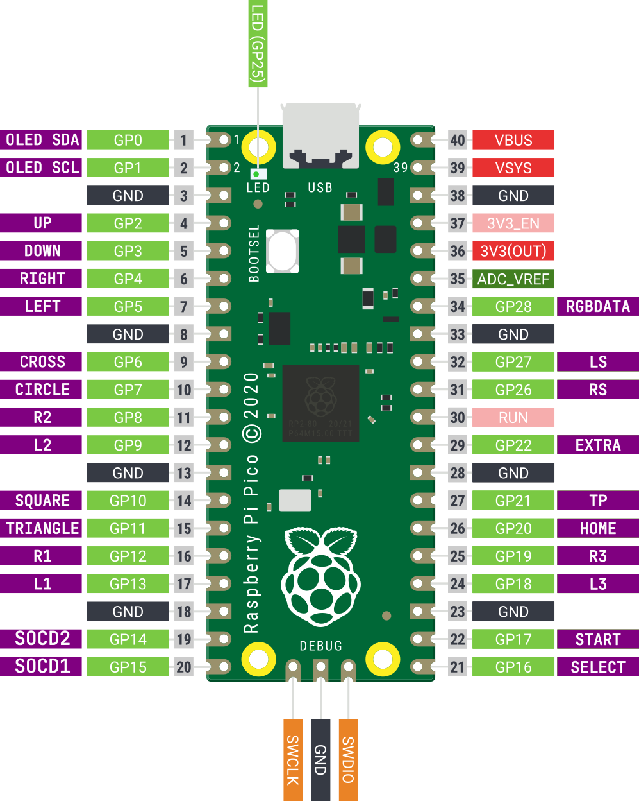

# GP2040 Configuration for ACES Split MK1



## Build

In the root of GP2040-CE project, run the following commands

```
mkdir build
cd build
cmake .. && make -j4
```

## Difference from default Pico pinout 

### Changes made in Main Pin Definition section

- Remove Turbo from GPIO pin 14, Set to -1
- Remove Turbo LED from GPIO pin 15, Set to -1
- Add PIN_SLIDER_LS to GPIO pin 27
- Add PIN_SLIDER_RS to GPIO pin 26
- Set PIN_SLIDER_SOCD_ONE to GPIO pin 14
- Set PIN_SLIDER_SOCD_TWO to GPIO pin 15

#### Changes for Left Handed Layout

- Changed PIN_DPAD_LEFT to GPIO pin 4
- Changed PIN_DPAD_RIGHT to GPIO pin 5
- Changed PIN_BUTTON_S2 to GPIO pin 16
- Changed PIN_BUTTON_S1 to GPIO pin 17
- Changed PIN_BUTTON_R3 to GPIO pin 18
- Changed PIN_BUTTON_L3 to GPIO pin 19

### Changes made in Add On configuration

- Add Extra Button to GPIO pin 22

## Changes to default Pico Add On Configuration

### SOCD Slider

- Add Enable definition

```
#define SLIDER_SOCD_ENABLED 1
```

- Set SLIDER_SOCD_SLOT_ONE to SOCD_MODE_NEUTRAL
- Set SLIDER_SOCD_SLOT_TWO to SOCD_MODE_UP_PRIORITY
  
## Joystick Selection Slider

- Add Enable definition

```
#define JSLIDER_ENABLED 1
```

### RGB LED
- Set LED_BRIGHTNESS_MAXIMUM to 80
- Set LED_BRIGHTNESS_STEPS to 10
- Change LED Chain Order

```
#define LEDS_DPAD_LEFT   0
#define LEDS_DPAD_DOWN   1
#define LEDS_DPAD_RIGHT  2
#define LEDS_BUTTON_B3   3
#define LEDS_BUTTON_B4   4
#define LEDS_BUTTON_R1   5
#define LEDS_BUTTON_L1   6
#define LEDS_BUTTON_L2   7
#define LEDS_BUTTON_R2   8
#define LEDS_BUTTON_B2   9
#define LEDS_BUTTON_B1   10
#define LEDS_DPAD_UP     11
```

Waiting to add Extra Button to RGB LED chain

### Extra Button Add On
- Add Enable definition

```
#define EXTRA_BUTTON_ENABLED 1
```

- Change EXTRA_BUTTON_MASK to GAMEPAD_MASK_DU
- Change EXTRA_BUTTON_PIN to 22